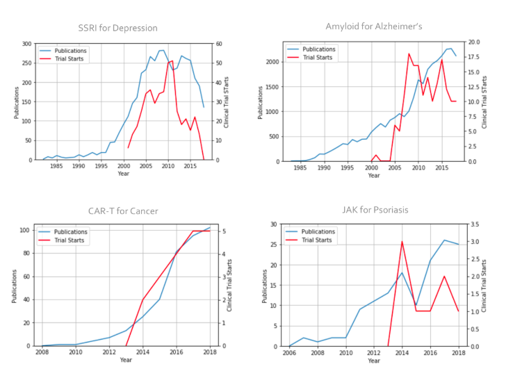
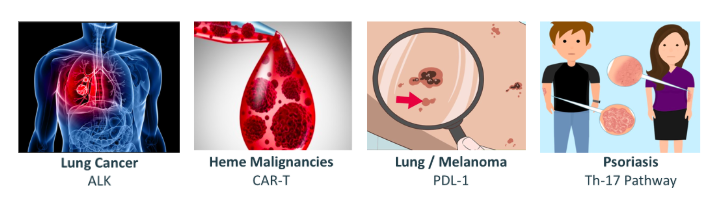

# Classifying Medical Innovation 
## Inspiration
We noticed a pattern in scientific literature. 
When biomedical innovation happens, we see an almost-exponential increase in publications, followed by many clinical trial starts.
If we can predict  innovation from publication velocity...
  1. Investors can predict stock price increases
  2. Biomedical companies can gain an early advantage 
  3. Patients can benefit from accelerated innovation 

## The Project
The early steps of automating an intelligent way to triage publications into innovation categories.
The obejective is to develop a classification model through a machine learning approach to automate the categorization of new literature. PubMed has approximately 29 million articles in their database with 200,000 updates monthly which is why this step needs to be automated. 

  **Target Innovation Topics:**

## The Approach
  1. Collect, clean, and aggregate literature abstracts as training and testing data
  2. Prepare training corpus (Stop words, Lemmatization, Bigrams and Trigrams)
  3. Generate models (LDA unsupervised, Naïve Bayes Classifier)
  4. Visualize and assess quality of prediction and Refine models as needed

## Summary
  1. Built and evaluated multiple models - unsupervised and supervised
  2. Visualization is key to assessing model performance
  3. The supervised (Naive Bayes) with GridSearch parameter optimization performed best at 95% accuracy
